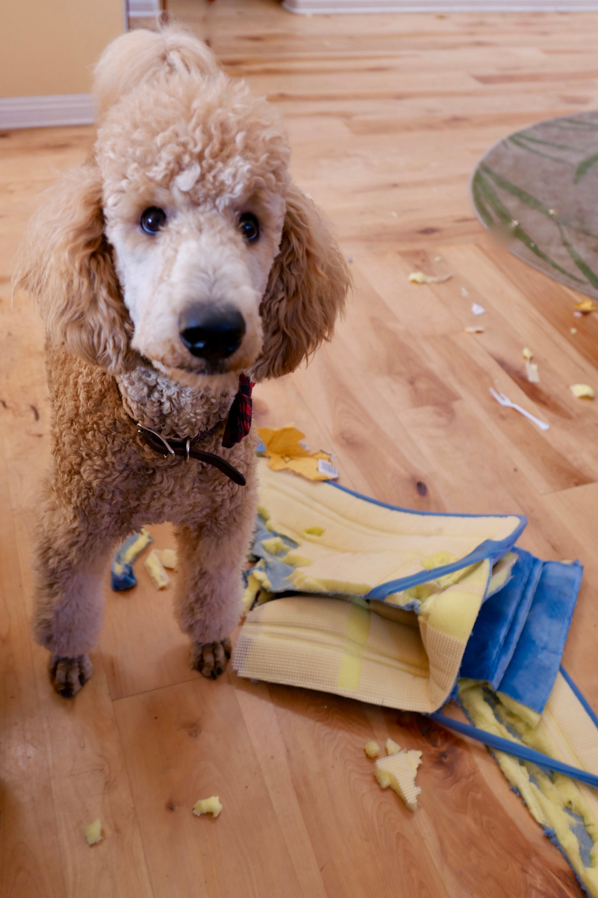

**Mi a teendő akkor, ha a kutyád folyton nyüzsög? Az örökmozgó, heveskedő ebekkel bizony olykor nehéz bánni, ám szerencsére megfelelő odafigyeléssel kezelhető a probléma.**

Egyes négylábúak hajlamosak túlpörögni, és ez különösen kellemetlen lehet akkor, ha például egy olyan vendéget fogadsz otthonodba, aki kevésbé értékeli ezt a magatartást. Ismerős a helyzet, hogy a felspannolt kedvenc különböző szituációkban hajlamos az ugrándozásra, az ugatásra, és a túlmozgás közben még tárgyakat is képes felborítani? Ez nem csak a környezeted számára lehet fárasztó, hanem számodra is, hiszen egy ilyen kutya sokkal nagyobb törődést és figyelmet igényel.

## Mi áll a dolog hátterében?

Nem árt tudni, hogy egyes fajták az átlagosnál sokkal több mozgást igényelnek, és kifejezetten energikusnak mondhatók. Ilyen fajta például a jack russel terrier. Ha olyan kedvenced van, aki fajtajellegéből adódóan viszi túlzásba az aktivitást, akkor érdemes már kölyökkorától kezdve sokat foglalkozni vele. Ha nincs feladatuk vagy nem mozognak eleget, ezek az ebek unatkozni kezdenek, és megfelelő tréning hiányában kezelhetetlenné válhatnak.

A kutya a személyiségéből fakadóan is lehet nyüzsgő jószág, aki folyamatosan igényli az új ingereket, ezért a megfelelő mozgás és törődés számára is nagyon fontos. Hiperkinézis, vagyis fiziológiai rendellenesség is állhat a dolog mögött, bár ez az ebeknél igen ritka viselkedésbeli állapot. Ha nem vagy biztos abban, hogy jószágod esetleg nem küzd-e mentális zavarokkal, akkor keress fel egy állatorvost.

## Mit lehet tenni?

Ha azt tapasztalod, hogy a kutyusod túlpörög, esetleg ugrándozik, gyakran ugat, körbe-körbe forog, akkor valószínűleg nincsenek kellőképpen levezetve az energiái. Ezért érdemes pár dolgot észben tartani, hogy a probléma mérsékelhető legyen.

### Mozgás

Nem elég hangsúlyozni, hogy egy pörgős eb számára mennyire fontos a rendszeres testmozgás. Ha kisebb korában ez elmaradt, akkor célszerű mihamarabb pótolni a dolgot. Lehetőleg vidd el minden nap sétálni vagy futni. Ha nincs időd rá, akkor kérj meg egy közeli családtagot, ismerőst, akit az állat is ismer és elfogad. Érdemes ezt mindig ugyanabban az időpontban, napszakban megejteni, hiszen akkor a négylábú számára ez idővel kiszámíthatóvá válik, és a séták során is nyugodtabban viselkedhet.

### Kiegyensúlyozott étrend

Nagyon fontos a megfelelő, kiegyensúlyozott és tartalmas étrend kialakítása. Ha az állat nem jut hozzá bizonyos összetevőkhöz vagy érzékeny rájuk, akkor könnyen nyugtalanná válhat. Szerencsére léteznek olyan speciális tápok, melyek kifejezetten energikus kutyák számára lettek kifejlesztve, és kielégítik szükségleteiket. Ha nem vagy biztos abban, hogy milyen táplálék való kedvenced számára egészségének fenntartása érdekében, akkor kérd ki szakértő véleményét.

### Adj neki feladatot!

Ha az állat különösen energikus, akkor érdemes az elméjét is lefoglalni valamivel. Hiszen nem csupán a fizikai, hanem a mentális igénybevétel is ugyanolyan fontos kutyád számára. Adj neki különböző feladatokat: számos olyan játék létezik, melyek specifikusan arra lettek kifejlesztve, hogy a négylábú figyelmét lekössék. Akár te is találhatsz ki játékokat házilag: például rejtsd el valahol kedvenc csemegéjét, majd ha közel jár a keresésben, reagálj boldog, izgatott hangon. Ha eltávolodik a célponttól, akkor válts nyugodtabb hangnemre.

Akármilyen játékot választasz, kedvenced biztosan hálás lesz érte. A szellemi munka akár egy jó testmozgással is felérhet, érdemes a kettőt úgy alkalmazni, hogy kiegészítsék egymást. Tehát ha van időd, a séta után iktass be egy kis játékot is, mely igényli a kutya figyelmét!

### Fektess le szabályokat

Ne feledd, hogyha az eb túlzásba viszi a dolgokat, és nagyon kezelhetetlen, akkor érdemes bizonyos szabályokat lefektetni. Az csak rajtad múlik, hogy meddig mehet el az állat, de mindig légy következetes. A nevelés szerepe kulcsfontosságú. Már a kezdetektől ne hagyd, hogy kedvenced felugráljon akár rád, akár másokra. Azt sem kell mosolyogva nézned, ahogy a kölyök feldönti a bútorokat. Húzz határokat és tartsd is meg őket. Ha tanácstalan vagy, bátran fordulj trénerhez.